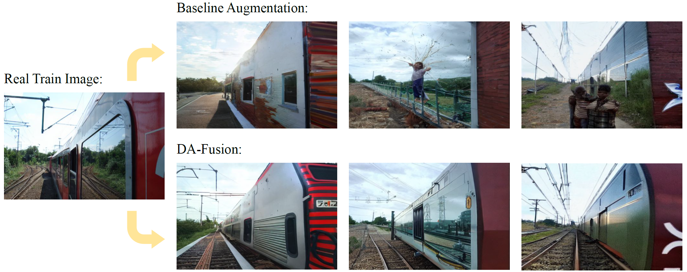

[Zurück](https://github.com/PaulToast/Bachelorarbeit-Synthetische-Daten)
# Effective Data Augmentation With Diffusion Models

[Original Repository](https://github.com/brandontrabucco/da-fusion) | [Website](btrabuc.co/da-fusion) | [Paper](https://openreview.net/forum?id=ZWzUA9zeAg)



### Abstract

Data augmentation is one of the most prevalent tools in deep learning, underpinning many recent advances, including those from classification, generative models, and representation learning. The standard approach to data augmentation combines simple transformations like rotations and flips to generate new images from existing ones. However, these new images lack diversity along key semantic axes present in the data. Current augmentations cannot alter the high-level semantic attributes, such as animal species present in a scene, to enhance the diversity of data. We address the lack of diversity in data augmentation with image-to-image transformations parameterized by pre-trained text-to-image diffusion models. Our method edits images to change their semantics using an off-the-shelf diffusion model, and generalizes to novel visual concepts from a few labelled examples. We evaluate our approach on few-shot image classification tasks, and on a real-world weed recognition task, and observe an improvement in accuracy in tested domains.

## Setting up benchmark & custom datasets

To benchmark DA-Fusion, we use a classification task derived from COCO (2017).

Download the [2017 Training Images](http://images.cocodataset.org/zips/train2017.zip), the [2017 Validation Images](http://images.cocodataset.org/zips/val2017.zip), and the [2017 Train/Val Annotations](http://images.cocodataset.org/annotations/annotations_trainval2017.zip).

These files should be unzipped with the following directory structure:

```
coco2017/
    train2017/
    val2017/
    annotations/
```

You may need to edit the dataset path in `semantic_aug/datasets/coco.py`.

To set up custom datasets, you need to implement your own subclass of `semantic_aug/few_shot_dataset.py`, or start with a copy of `semantic_aug/datasets/coco.py` as an example.

## Fine-Tuning Tokens

We perform [Textual Inversion](https://arxiv.org/abs/2208.01618) to adapt Stable Diffusion to the classes present in our few-shot datasets. The implementation in `fine_tune.py` is adapted from the [Diffusers](https://github.com/huggingface/diffusers/blob/main/examples/textual_inversion/textual_inversion.py) example.

Here is an example for executing the script on the MVIP dataset:

```bash
python fine_tune.py --dataset=mvip --output_name="mvip-test" \
--pretrained_model_name_or_path="CompVis/stable-diffusion-v1-4" \
--initializer_token="motor" --num_vectors=16 --validation_prompt="a photo of a {}" \
--resolution=512 --crop_object --train_batch_size=16 \
--lr=5.0e-04 --lr_warmup_steps=150 --lr_scheduler="constant_with_warmup" \
--gradient_accumulation_steps=1 --max_train_steps=1000 \
--mixed_precision=fp16 --revision=fp16 --gradient_checkpointing \
--num_trials=1 --examples_per_class=32
```

The trained token weights will be saved under `output/{experiment_name}/fine-tuned`.

## Aggregate Embeddings

Before generating augmentations, we call the script `aggregate_embeddings.py`, which merges all of the learned tokens together into a single directory, creating a class-agnostic template to use for the next steps:

```bash
python aggregate_embeddings.py --output_name="mvip-test" \
--num_trials=1 --examples_per_class=32
```

The results will be saved under `output/{experiment_name}/fine-tuned-merged`.

## Generate Augmentations

In order to generate augmentations, a connection to the HuggingFace API has to be set up.

Run the following in your terminal:

```bash
pip install --upgrade huggingface_hub
huggingface-cli login
```

You will be prompted for your HuggingFace account credentials, and for an access token that you may create for your account by following [this guide](https://huggingface.co/docs/huggingface_hub/quick-start#login).

Afterwards, we can call the `generate_augmentations.py` script with the according parameters, for example:

```bash
python generate_augmentations.py --dataset=mvip --output_name="mvip-test" \
--aug_name="augs" --model_path="CompVis/stable-diffusion-v1-4" \
--examples_per_class=16 --num_synthetic=4 --strength=0.2 --guidance_scale=15
```

The images will be saved under `output/{experiment_name}/aug`

There are several ways to configure the augmentation:

- `--prompt`: A custom prompt can be specified; Will default to "a photo of a {name}".
- `--aug`: The method for generating the augmentations, either "real-guidance" or "textual-inversion"
- `--guidance_scale`: Represents how much importance is given to your prompt when generating images. Lower values will give less attention to the prompt, but generate more freely. Will default to 7.5
- ...