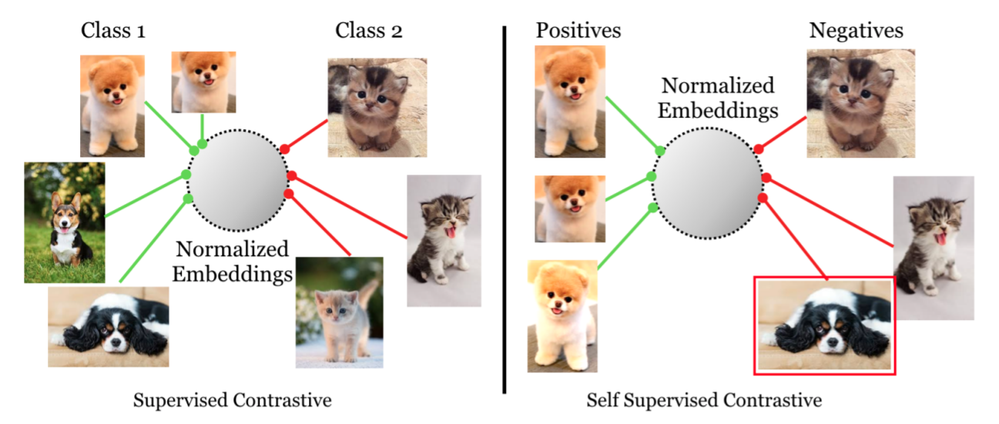
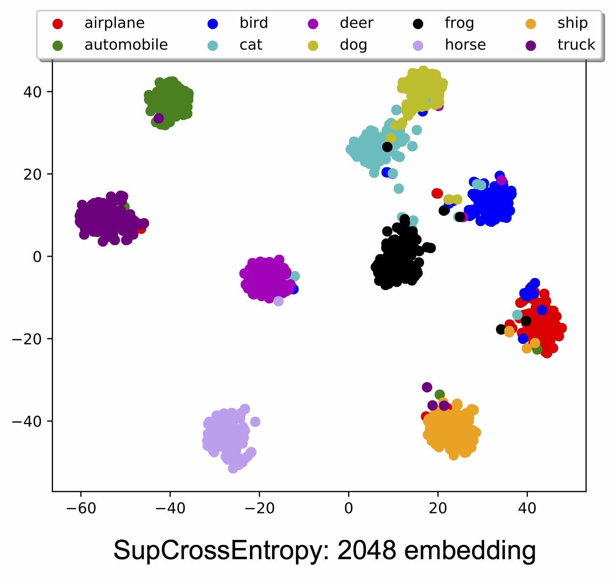
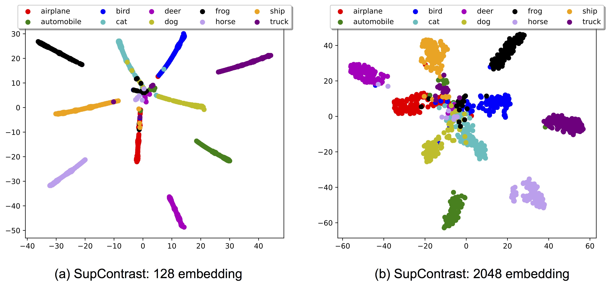
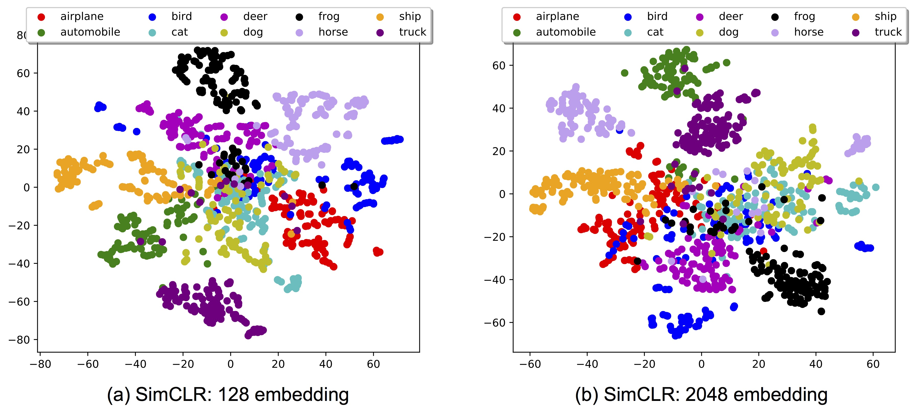

[Zurück](https://github.com/PaulToast/Bachelorarbeit-Synthetische-Daten)
# SupContrast: Supervised Contrastive Learning

[Original Repository](https://github.com/HobbitLong/SupContrast) | [Paper](https://arxiv.org/abs/2004.11362)



### Abstract

Contrastive learning applied to self-supervised representation learning has seen a resurgence in recent years, leading to state of the art performance in the unsupervised training of deep image models. Modern batch contrastive approaches subsume or significantly outperform traditional contrastive losses such as triplet, max-margin and the N-pairs loss. In this work, we extend the self-supervised batch contrastive approach to the fully-supervised setting, allowing us to effectively leverage label information. Clusters of points belonging to the same class are pulled together in embedding space, while simultaneously pushing apart clusters of samples from different classes. We analyze two possible versions of the supervised contrastive (SupCon) loss, identifying the best-performing formulation of the loss. On ResNet-200, we achieve top-1 accuracy of 81.4% on the ImageNet dataset, which is 0.8% above the best number reported for this architecture. We show consistent outperformance over cross-entropy on other datasets and two ResNet variants. The loss shows benefits for robustness to natural corruptions and is more stable to hyperparameter settings such as optimizers and data augmentations. Our loss function is simple to implement, and reference TensorFlow code is released at [this https URL](https://github.com/google-research/google-research/tree/master/supcon).

## Loss Function
The loss function [`SupConLoss`](https://github.com/HobbitLong/SupContrast/blob/master/losses.py#L11) in `losses.py` takes `features` (L2 normalized) and `labels` as input, and return the loss. If `labels` is `None` or not passed to the it, it degenerates to SimCLR.

Usage:
```python
from losses import SupConLoss

# define loss with a temperature `temp`
criterion = SupConLoss(temperature=temp)

# features: [bsz, n_views, f_dim]
# `n_views` is the number of crops from each image
# better be L2 normalized in f_dim dimension
features = ...
# labels: [bsz]
labels = ...

# SupContrast
loss = criterion(features, labels)
# or SimCLR
loss = criterion(features)
...
```

## Running
You might use `CUDA_VISIBLE_DEVICES` to set proper number of GPUs, and/or switch to CIFAR100 by `--dataset cifar100`.  
**(1) Standard Cross-Entropy**
```
python main_ce.py --batch_size 1024 \
  --learning_rate 0.8 \
  --cosine --syncBN \
```
**(2) Supervised Contrastive Learning**  
Pretraining stage:
```
python main_supcon.py --batch_size 1024 \
  --learning_rate 0.5 \
  --temp 0.1 \
  --cosine
```

<s>You can also specify `--syncBN` but I found it not crucial for SupContrast (`syncBN` 95.9% v.s. `BN` 96.0%). </s>

WARN: Currently, `--syncBN` has no effect since the code is using `DataParallel` instead of `DistributedDataParaleel`

Linear evaluation stage:
```
python main_linear.py --batch_size 512 \
  --learning_rate 5 \
  --ckpt /path/to/model.pth
```
**(3) SimCLR**  
Pretraining stage:
```
python main_supcon.py --batch_size 1024 \
  --learning_rate 0.5 \
  --temp 0.5 \
  --cosine --syncBN \
  --method SimCLR
```
The `--method SimCLR` flag simply stops `labels` from being passed to `SupConLoss` criterion.
Linear evaluation stage:
```
python main_linear.py --batch_size 512 \
  --learning_rate 1 \
  --ckpt /path/to/model.pth
```

On custom dataset:
```
python main_supcon.py --batch_size 1024 \
  --learning_rate 0.5  \ 
  --temp 0.1 --cosine \
  --dataset path \
  --data_folder ./path \
  --mean "(0.4914, 0.4822, 0.4465)" \
  --std "(0.2675, 0.2565, 0.2761)" \
  --method SimCLR
```

The `--data_folder` must be of form ./path/label/xxx.png folowing https://pytorch.org/docs/stable/torchvision/datasets.html#torchvision.datasets.ImageFolder convension.

and 
## t-SNE Visualization

**(1) Standard Cross-Entropy**
<p align="center">
  
</p>

**(2) Supervised Contrastive Learning**
<p align="center">
  
</p>

**(3) SimCLR**
<p align="center">
  
</p>